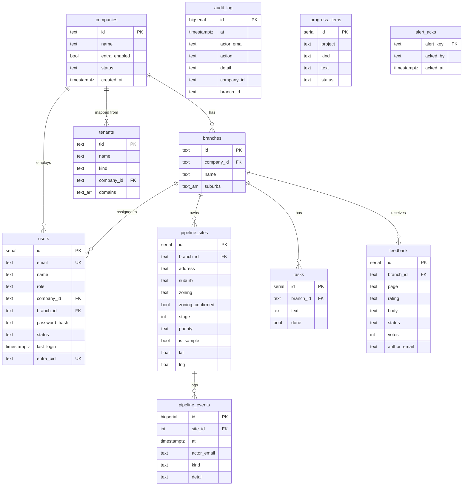

# Database Design

Source of truth: `db/migrations/*.sql` (001 to 009). Applied by `scripts/migrate.mjs`, tracked in `_migrations(name, at)`.

## ERD

`audit_log.company_id` and `branch_id`, `pipeline_events.actor_email`, `feedback.author_email` and `alert_acks.acked_by` are plain text, not foreign keys.

## Tables

| Table | Purpose | Notes |
|---|---|---|
| `companies` | Client organisations (seed: `prd`) | `entra_enabled`, `status` |
| `branches` | Branches within a company with suburb lists (seed: `pen`, `bm`, `gp`) | cascade delete with company |
| `users` | App users and roles | roles: platform_admin, company_admin, branch_admin, marketing, agent, viewer; `entra_oid` pins the Microsoft identity; `password_hash` only for fallback login |
| `tenants` | Entra tenant ID to company/platform mapping and allowed email domains | seeded with REMAP.ai (platform) and PRD Group (company, only if company `prd` exists). Tenant IDs are public |
| `pipeline_sites` | Development sites, stage 0 to 9, priority H/M/L, zoning with confirmation flag, DA fields, lat/lng, `is_sample` | six real DAs seeded with zoning TBC; 30 planning items and 25 REA land listings from the 7 Oct 2026 sourcing run loaded by `npm run db:seed-real` (`site_kind` da or listing); sample rows flagged |
| `pipeline_events` | History of stage moves and zoning confirmations | cascade with site |
| `tasks` | Activity and tasks | `due` is free text |
| `feedback` | Feedback with rating, status, votes | status values enforced in app, not by constraint |
| `progress_items` | Delivery progress (ask, shipped, blocker, milestone) | not branch-scoped |
| `alert_acks` | Acknowledged alert keys | |
| `audit_log` | Append-only audit trail | append-only by convention only; no DB-level protection yet |
| `_migrations` | Applied migration names | created by the runner |

## Indexes and constraints

- Primary keys on all tables; unique: `users.email`, `users.entra_oid`.
- `audit_log_at` on `audit_log (at desc)`.
- Checks: `users.role`, `pipeline_sites.stage` 0 to 9, `pipeline_sites.priority`, `progress_items.kind`, `tenants.kind`.
- No index yet on `pipeline_sites.branch_id`, `pipeline_events.site_id`, `tasks.branch_id`, `feedback` ordering, or `lower(users.email)` (queries use `lower(email)`, so the unique index is not used for those lookups). Add when row counts justify.

## Migration rules

- Add a new numbered file; never edit an applied one.
- Idempotent (`if not exists`, `add column if not exists`, `on conflict do nothing`); each file runs in one transaction.
- Backwards compatible with the previous app version where possible (the new image runs migrations before serving; the old image may still be rolled back to).
- See rollback policy in `docs/deployment/rollback-process.md`.

## Retention

| Data | Retention |
|---|---|
| Audit log | TBC (SRS suggests integration log retention 90 days; audit retention undecided) |
| Feedback, tasks, pipeline events | Kept; no purge yet |
| Conversations and buyer PII | Not stored in this database; held in the n8n conversation store/Google Sheet. Retention policy TBC (SRS 8.3) |
| Sessions | Stateless JWT, 8 h |

## PII handling

- The dashboard database holds staff and client-user data (name, email, role, optional password hash, Entra object ID) and feedback text. No buyer data is persisted here.
- Buyer PII is read live from the n8n log, masked by default (`mask()`), revealed only to roles where `canRevealPii` is true (everyone except viewer). The spec calls for logging reveals; reveal logging is TBC.
- Never log or print password hashes, tokens or buyer contact details. Sample data uses fictional names only.
- Export or delete on request: manual process, TBC.

## Development Playbook tables (migrations 008 and 009)

The Development Playbook page (route `/pipeline`) mirrors the Developer_playbook Google Sheet, which the weekly n8n run writes. Each run posts its rows to `POST /api/ingest/playbook`.

| Table or column | Purpose |
|---|---|
| `pipeline_sites` (existing) | One row per application per council. Key: `(branch_id, da_type, da_number)`. New columns: `action_taken`, `zone_code`, `zone_name`. `priority` may now be null because the sheet has no priority column. Sheet columns are overwritten on each run; `stage`, `assignee` and stage history belong to the app and are never overwritten |
| `playbook_weeks` | One row per branch per Monday-start week the workflow ran (`run_at`, `rows_total`) |
| `playbook_week_items` | The applications that run flagged as new or changed (`flag`, `status_at_week`). The page shows a week's items from here |
| `playbook_companies` | The Director & Company Lookup tab: name, linked address, ACN/ABN, ASIC done, directors, role, contact details, source used, notes. Only what the sheet holds |

Council to branch: Penrith is `pen`, Blue Mountains is `bm` (`COUNCIL_BRANCH` in `src/lib/playbook.ts`).

Migration 009 deletes the rows the page showed before the weekly feed (invented rows, the 23 Jul and 7 Oct source observations, REA listings) and the progress lines that described them. It was approved by the project owner on 2026-10-09, is targeted by `is_sample`, `site_kind` and `source`, and never touches rows from the feed (source "NSW Planning Portal").
