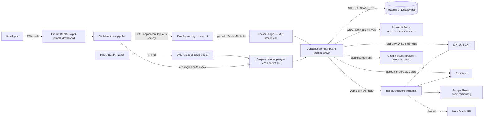

# Infrastructure

Status: 2026-10-06. Items marked TBC are unverified or undecided.

## 1. Environments

| Environment | Where | URL | Branch | Database | Config | Status |
|---|---|---|---|---|---|---|
| Local | Developer machine, `npm run dev` | http://localhost:3000 | any | Shared Postgres on the Dokploy host (same as staging, for now) | `.env.local` (gitignored) | In use |
| Test (CI and local e2e) | GitHub Actions `postgres:16` service container, or a throwaway local Postgres | http://localhost:3100 | any | `TEST_DATABASE_URL`, throwaway | CI env | Being added |
| Staging | Dokploy application `prd-dashboard-staging`, project "PRD Penrith Dashboard" | https://prd.remap.ai | `staging` | Shared Postgres (see section 6) | Dokploy env vars | Live |
| Production | Second Dokploy application | TBC (own domain) | `production` | Own database (required) | Own `AUTH_SECRET` and env vars | Planned, not created |

## 2. Hosting and network

Notes
- The buyer enquiry automation runs on n8n, not in this app. The app only reads its results.
- Dotted lines are planned.
- TLS terminates at the Dokploy proxy. Container listens on port 3000 and is not published directly (TBC: confirm the Postgres port exposure and firewall rules on the Dokploy host).

## 3. Secrets and configuration

| What | Where it lives | Notes |
|---|---|---|
| Runtime env vars (staging) | Dokploy application environment | Names in `.env.example` |
| Local env vars | `.env.local` (gitignored). Files `env` and `env (1)` also exist locally and must never be committed or read by AI tools | Confirm they are gitignored (TBC) |
| Pipeline credentials | GitHub secrets `DOKPLOY_URL`, `DOKPLOY_API_KEY` | Environment `staging` |
| Pipeline settings | GitHub variables `DOKPLOY_STAGING_APP_ID`, `STAGING_URL`, `DOKPLOY_PRODUCTION_APP_ID` (unset) | Not secret |
| Vendor credentials | Held in PRD's name (Vault, ClickSend); REMAP holds working copies in Dokploy and n8n credential storage only | SRS A1 |
| Shared credentials | Secure credentials service only, never chat or email | |

Rotation procedure (per secret)
1. Generate the new value at the source (Entra app registration, Vault/MRI, ClickSend, n8n, Dokploy, Postgres).
2. Update the Dokploy environment variable (and `.env.local` for developers via the secure service).
3. Redeploy staging (merge to `staging` or redeploy in Dokploy) and run the verification checklist in `docs/deployment/deployment-process.md`.
4. Revoke the old value at the source.
5. Record the date and who rotated in Jira (never the value).
- `AUTH_SECRET` rotation signs everyone out (acceptable). `DOKPLOY_API_KEY`: also update the GitHub secret.

Known exposure to rotate
- Vault, website admin, Outlook and ClickSend credentials were shared in plain email in August to September 2026 (see `docs/requirements/engagement-context.md`, issue 17). Rotate and move to the secure credentials service. Owner: Hamza/Irfan with Lily. Status: TBC.
- Any credential ever pasted in chat or committed must be treated as compromised.
- The n8n conversation webhook sends its passphrase as URL query parameters (`email`, `key`), which can appear in n8n or proxy access logs. It is now deprecated and opt-in (`CONVERSATIONS_WEBHOOK_ENABLED=true`, default off); the database feed supersedes it, and the URL is never put in an error message or log.

## 4. CI/CD pipeline

Workflow `.github/workflows/pipeline.yml`, name `pipeline`.

| Item | Detail |
|---|---|
| Triggers | `pull_request` to `staging` or `production`; `push` to `staging` or `production` |
| Concurrency | group `pipeline-<ref>`; in-progress runs cancelled only for pull requests, never for pushes (deploys finish) |
| Job `ci` | checkout, Node 22 with npm cache, `npm ci`, `npm run lint`, `npx tsc --noEmit`, `npm run build`. The testing workstream adds coverage here |
| Job `e2e` (being added) | `postgres:16` service container, Playwright against port 3100 using `TEST_DATABASE_URL` |
| Job `deploy-staging` | Only on push to `staging`; `needs` `ci` (and `e2e` once added); environment `staging`; POST `$DOKPLOY_URL/api/application.deploy` with `applicationId`, `title` (short SHA), `description`; fails if HTTP code is 300 or above |
| Health check | Polls `$STAGING_URL/login` every 15 s, up to 40 times (10 minutes), passes on HTTP 200 |
| Job `deploy-production` | Only on push to `production` and only if variable `DOKPLOY_PRODUCTION_APP_ID` is set (it is not), so production does not deploy |
| Artifacts | None uploaded. The Docker image is built on the Dokploy host, not in Actions or a registry |
| Gates | Branch protection is OFF by choice, so the gates are team rules: PR into `staging`, CI green, second reviewer for AI-assisted PRs, no direct pushes |

Limits: the health check proves `/login` renders, not that the database or integrations work. Deploy success means Dokploy accepted the request; the check confirms the new container answers (it could still be the old one, TBC: compare a version marker).

## 5. Runtime image

Three-stage `Dockerfile` on `node:22-alpine`: deps (`npm ci`), build (`npm run build`, standalone output), run (non-root user `app`, `PORT=3000`). Container command: `node scripts/migrate.mjs && node server.js`. A failing migration stops the container from starting.

## 6. Database operations

- Postgres 16 compatible (CI uses `postgres:16`); production version on Dokploy host: TBC.
- Migrations: `db/migrations/NNN_name.sql`, applied in filename order by `scripts/migrate.mjs`, each in a transaction and recorded in `_migrations`. They run on every container start and via `npm run db:migrate`.
- Shared DB caveat: local development and staging use the same database. Local seed runs, tests and experiments can alter staging data and users. Mitigation: tests use `TEST_DATABASE_URL` only; create a separate dev database (backlog P1). Production must have its own database.
- Seed (`scripts/seed.mjs`) is idempotent for users, branches and real DAs; sample rows are flagged `is_sample`.
- Backups: no automated backup or restore test is documented. TODO: enable scheduled `pg_dump` (or Dokploy database backups) with off-host storage and a quarterly restore drill. Owner TBC.
- Restore procedure: TODO until a backup exists.
- Migration rollback policy: see `docs/deployment/rollback-process.md`.

## 7. Observability and alerts

Exists
- Data Sources page (`/sources`): live health checks of Postgres, n8n, conversation log config, Vault, ClickSend, Entra (cached 60 s).
- Audit log page (`/audit`) and `audit_log` table: sign-ins, failures, denied Entra sign-ins, stage moves, zoning confirmations, user changes, feedback status.
- Alerts page (`/alerts`): Prototype status.
- Dokploy container logs and deployment history; GitHub Actions run history; n8n execution history.

Missing
- Uptime monitoring and paging for https://prd.remap.ai
- Application error tracking and structured logs with correlation IDs
- Alerts on failed deploys (only visible in Actions), failed migrations, database down, certificate expiry, credential expiry
- Retention and PII redaction rules for logs
- Dashboards for resource use

## 8. Security controls

| Control | State |
|---|---|
| TLS | Let's Encrypt via Dokploy proxy |
| AuthN | Entra OIDC with PKCE, state, nonce, issuer and audience check; fallback password (bcrypt) with in-memory rate limit (5 per 10 minutes per email, resets on restart and not shared across instances) |
| Session | Signed JWT (HS256), httpOnly, SameSite=Lax, Secure in production, 8 h |
| AuthZ | Role matrix in `src/lib/roles.ts`, `access()` in every page and action; queries scoped by branch/company |
| Input validation | zod on forms; numeric and enum checks in actions |
| SQL | Parameterised only |
| Data minimisation | Vault whitelist; PII masked unless `canRevealPii` |
| Security headers / CSP | Only `poweredByHeader: false`; CSP and rate limiting are not configured (backlog) |
| Container | Non-root user, standalone output |
| Repo | Public for now: no secrets allowed; branch protection off |
| Dependencies | Lockfile; no automated scanning (backlog) |

## 9. Capacity and cost

- Load is small: internal users only; Vault reads are cached (`revalidate` 300 s), conversations 60 s, health 60 s. Postgres pool max 5.
- Single container, single database, no horizontal scaling; in-memory login attempt map assumes one instance.
- Costs: Dokploy host and Postgres share an existing server (cost allocation TBC); GitHub Actions minutes (public repo, free tier); Vault Partner Connect USD 500/yr in PRD's name (per engagement context); ClickSend usage billed to PRD; Let's Encrypt free.
- Vault API daily quota and limits: TBC; cache aggressively (SRS 2.3).

## 10. Disaster recovery and rollback

- Application rollback: redeploy a previous deployment in Dokploy, or revert the merge commit on `staging` (see `docs/deployment/rollback-process.md`).
- Data loss or corruption: restore from backup (not yet available, see section 6). Until then the recovery point is "whatever the host snapshots", TBC.
- Host loss: rebuild Dokploy, recreate the application from the repo, restore env vars from the secure credentials service, restore Postgres from backup, repoint DNS. RTO and RPO targets: TBC.
- Entra or n8n outage: app stays up; sign-in via fallback password if enabled; integrations show Waiting on access.

## 11. Known gaps and infra backlog

| Priority | Item |
|---|---|
| P0 | Rotate credentials shared over email or chat; move to secure credentials service |
| P0 | Automated Postgres backups with off-host copy and a restore test |
| P1 | Separate dev database from staging; production database and `AUTH_SECRET` |
| P1 | Uptime monitoring and deploy-failure alerts (Teams, destination TBC with Darren) |
| P1 | Create production Dokploy application, domain, set `DOKPLOY_PRODUCTION_APP_ID`, add approval gate on the `production` environment |
| P1 | Turn on branch protection when plan or visibility allows (private repo or paid plan) |
| Done | Conversation webhook passphrase in query string: webhook is now opt-in and deprecated (`CONVERSATIONS_WEBHOOK_ENABLED`) |
| Done | CSP and security headers set in `next.config.ts` (HSTS in production only) |
| P2 | Shared rate limiting |
| P2 | Dependency and image scanning in CI (npm audit, Dependabot) |
| P2 | Version marker endpoint so the health check proves the new build is serving |
| P2 | Export n8n workflows to Git (SRS DOC-03) |
| P3 | Error tracking, structured logging, retention policy |
