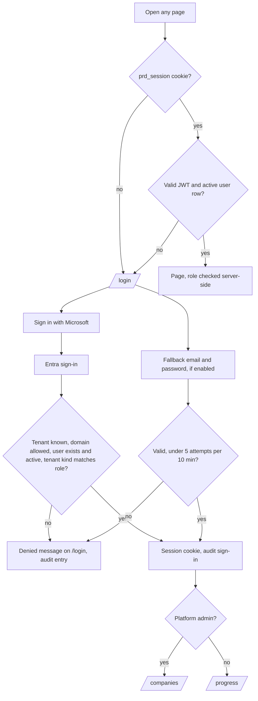
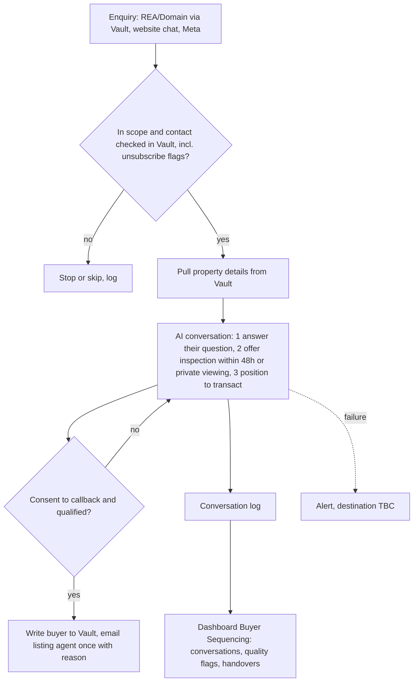
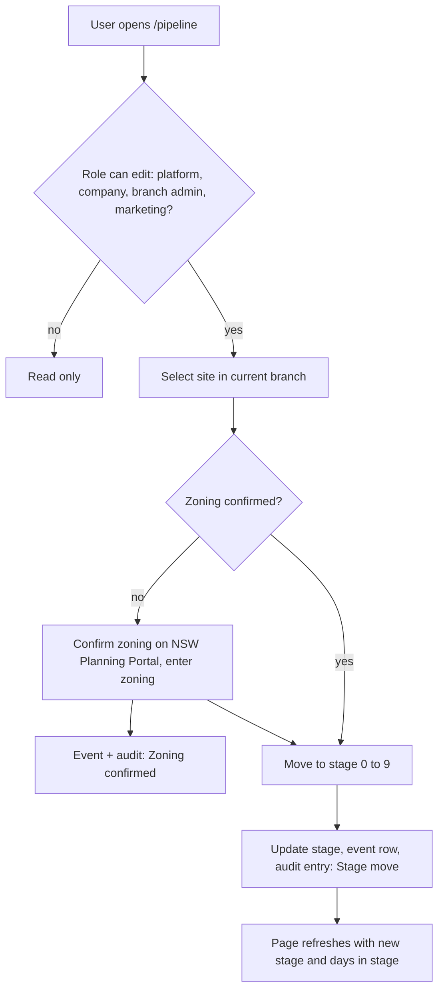
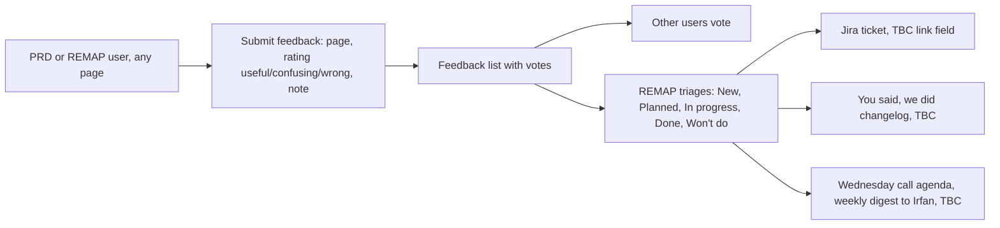

# User Flows

Derived from `srs.md`, `dashboard-spec.md` and the code. Items not confirmed are marked TBC.

## 1. Sign-in

## 2. Buyer enquiry (runs on n8n; dashboard reads results)

Notes: outbound SMS is held until ClickSend inbound is set up; STOP halts all messaging; Meta project ads do not feed Vault yet (Sheet, Thomas approves, Thea adds to Vault).

## 3. Pipeline stage movement

Stages: 1 Detected, 2 Qualified, 3 Owner traced, 4 Approached, 5 Negotiation, 6 Acquired or under contract, 7 Approved for development, 8 Marketing, 9 Selling, 10 Sold out or settled (stored as 0 to 9). Whether zoning must be confirmed before moving stage is not enforced in code today (TBC).

## 4. Feedback loop

Per-conversation "good / not good" ratings from the spec (4.14) are not built yet (TBC).
